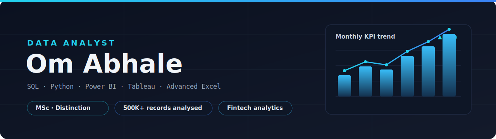

  

  
  
  

## About

Data Analyst who turns large, messy datasets into decisions leaders actually use.

- **MSc Data Science & Analytics — Distinction**, Royal Holloway, University of London
- Fintech analytics at **Paymint**: queried and wrangled **500K+** financial records (SQL + Python) for trend and anomaly analysis, and shipped Power BI dashboards tracking 8+ KPIs
- I work in **SQL, Python, Power BI, Tableau, and Advanced Excel**
- Focus: EDA, KPI dashboards, risk scorecards, and translating model output into plain-English decisions

## Toolkit

**Languages & querying**  

**BI & visualisation**  

**Data & cloud**  

## Featured projects

| Project | What it does | Stack |
|---|---|---|
| **[Housing Market Price Prediction](LINK)** | MSc dissertation — cross-validated ensemble models (Ridge, Random Forest, GBM) on Ames/Boston/California data; SHAP to surface the top 5 price drivers for non-technical readers. | Python, scikit-learn, SHAP |
| **[Digital Advertising Performance Analytics](LINK)** | Analysed 1,800 campaigns across Google/Meta/TikTok; found a 4.1x ROAS gap and built a budget-reallocation framework with an executive summary. | Python, Excel |
| **[HR Employee Attrition Analysis]([LINK](https://github.com/Omii9600/hr-attrition-analysis))** | 1,470-record HR study; built a risk scorecard tiering employees Low/Medium/High to support retention decisions. | Advanced Excel, Pivot Tables |
| **[Hospital Readmission Analysis](https://github.com/Omii9600/hospital-readmission-analysis)** | EDA on 66,587 patient encounters to identify readmission drivers. | Python |
| **[Porter Delivery Analysis](https://github.com/Omii9600/porter-delivery-analysis)** | End-to-end delivery-performance analysis of ~197K orders with a live interactive dashboard. | Excel |

## Let's connect

I'm looking for Data Analyst roles. Reach me on
[LinkedIn](https://www.linkedin.com/in/om-abhale-2519441a1/) or [email](mailto:abhaleom96@gmail.com).
